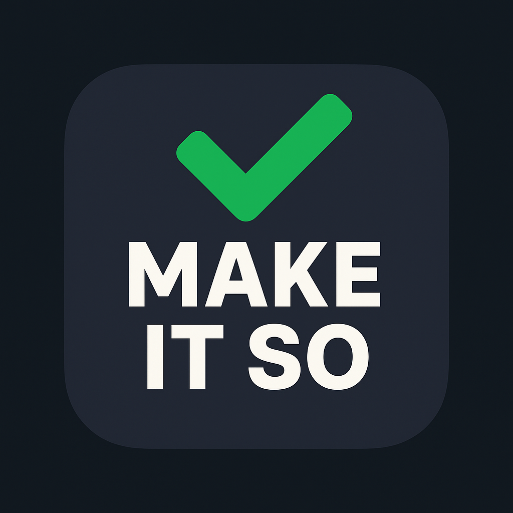
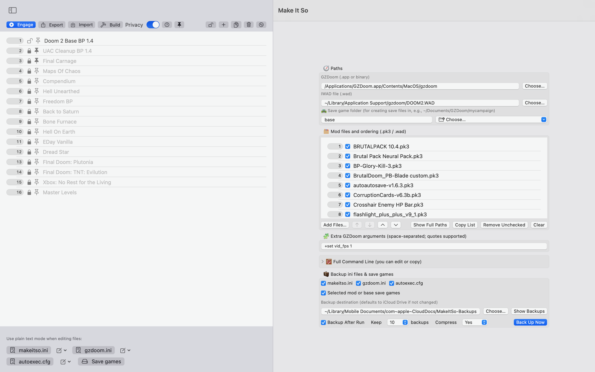
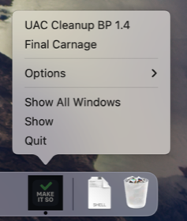

  

# Make It So: GZDoom Launcher
**A macOS-native launcher for GZDoom mods and profiles — clean UI, zero terminal required.**

---

### 📦 Download

- **Latest release**: [GitHub Releases](https://github.com/BobQuickSaveSmith/Make-It-So-GZDoom-Launcher/releases/latest)
- **Direct DMG**: [MakeItSo.dmg](https://github.com/BobQuickSaveSmith/Make-It-So-GZDoom-Launcher/releases/download/v1.0.0/MakeItSo.dmg)
- **Direct ZIP**: [MakeItSo.zip](https://github.com/BobQuickSaveSmith/Make-It-So-GZDoom-Launcher/releases/download/v1.0.0/MakeItSo.zip)

> 💡 _macOS Gatekeeper may block the app on first launch.  
> See [How to Open if Blocked](docs/MakeItSo_How_To_Open_App_If_Blocked.md) for help._

---

### ✨ Highlights

- Create profiles for IWADs/mods with different launch setups
- **Engage** (launch directly) or **Build** (export as a self-contained .app)
- Automatic backups for `gzdoom.ini`, `makeitso.ini`, saves, and `autoexec.cfg`
- Pin-to-Dock support, Privacy Mode, and profile editing tools
- No terminal required — just click and go

---

### 🚀 Quick Start

> 📄 See the full guide: [Quick Start](docs/MakeItSo_QuickStart.md)

---

### 📖 User Manual

> 📄 Explore full features and tips: [User Manual](docs/MakeItSo_Manual.md)

---

### 🖼 Screenshots

    
  

> 📸 More images may appear in Releases or the Wiki

---

### 📄 License

This project is licensed under the [MIT License](LICENSE).  
GZDoom and all mods referenced remain the property of their respective creators.

---

### 💬 Support & Feedback

If you spot a bug or want to request a feature, feel free to [open an issue](https://github.com/BobQuickSaveSmith/Make-It-So-GZDoom-Launcher/issues).

---