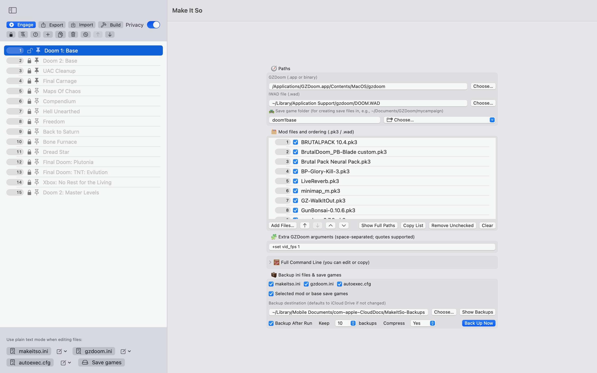

  

# Make It So: GZDoom Launcher
<!-- MIS-DOWNLOAD-BLOCK-START -->
## 🔽 Download

> 💾 **Latest Release:** [https://github.com/.../releases/latest](https://github.com/BobQuickSaveSmith/Make-It-So-GZDoom-Launcher/releases/latest)

<!-- MIS-DOWNLOAD-BLOCK-END -->
**A macOS-native launcher for GZDoom mods and profiles — clean UI, zero terminal required.**

---

### 📦 Download

- **Direct DMG**: [MakeItSo_macOS.dmg](https://github.com/BobQuickSaveSmith/Make-It-So-GZDoom-Launcher/releases/latest/download/MakeItSo_macOS.dmg)
- **Direct ZIP**: [MakeItSo_macOS.zip](https://github.com/BobQuickSaveSmith/Make-It-So-GZDoom-Launcher/releases/latest/download/MakeItSo_macOS.zip)
- **SHA-256**: [MakeItSo_macOS.sha256.txt](https://github.com/BobQuickSaveSmith/Make-It-So-GZDoom-Launcher/releases/latest/download/MakeItSo_macOS.sha256.txt)

> 💡 _macOS Gatekeeper may block the app on first launch.  
### ✨ Highlights

- Create profiles for IWADs/mods with different launch setups
- **Engage** (launch directly) or **Build** (export as a self-contained .app)
- Automatic backups for `gzdoom.ini`, `makeitso.ini`, saves, and `autoexec.cfg`
- Pin-to-Dock support, Privacy Mode, and profile editing tools
- No terminal required — just click and go

---

### 🚀 Quick Start

> 📄 See the full guide: [Quick Start](docs/MakeItSo_QuickStart.md)

---

### 📖 User Manual

> 📄 Explore full features and tips: [User Manual](docs/MakeItSo_Manual.md)

---

### 🖼 Screenshot

  

> 📸 More images may appear in Releases or the Wiki

---

### 📄 License

This project is licensed under the [MIT License](LICENSE).  
GZDoom and all mods referenced remain the property of their respective creators.

---

### 💬 Support & Feedback

If you spot a bug or want to request a feature, feel free to [open an issue](https://github.com/BobQuickSaveSmith/Make-It-So-GZDoom-Launcher/issues).
- **SHA256**: [MakeItSo_macOS.sha256.txt](https://github.com/BobQuickSaveSmith/Make-It-So-GZDoom-Launcher/releases/latest/download/MakeItSo_macOS.sha256.txt)

## Legal Disclaimer

\
Make It So is an unofficial, fan‑made launcher for GZDoom and DOOM‑compatible files.

\
DOOM is a registered trademark of id Software LLC, a ZeniMax Media company.
\
GZDoom is a separate, third‑party project owned by its respective developers.
\
This app is not affiliated with, endorsed by, or sponsored by id Software, ZeniMax, or the GZDoom developers.

\
Provided “AS IS”, without warranty of any kind. Use at your own risk.

